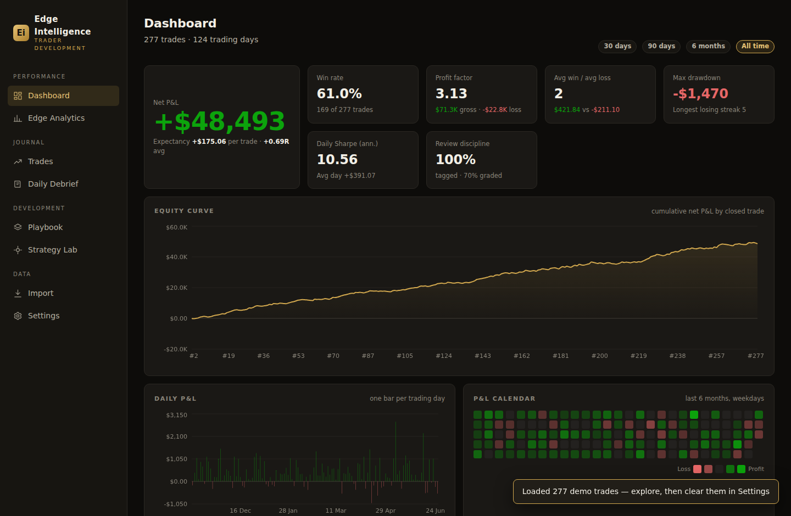
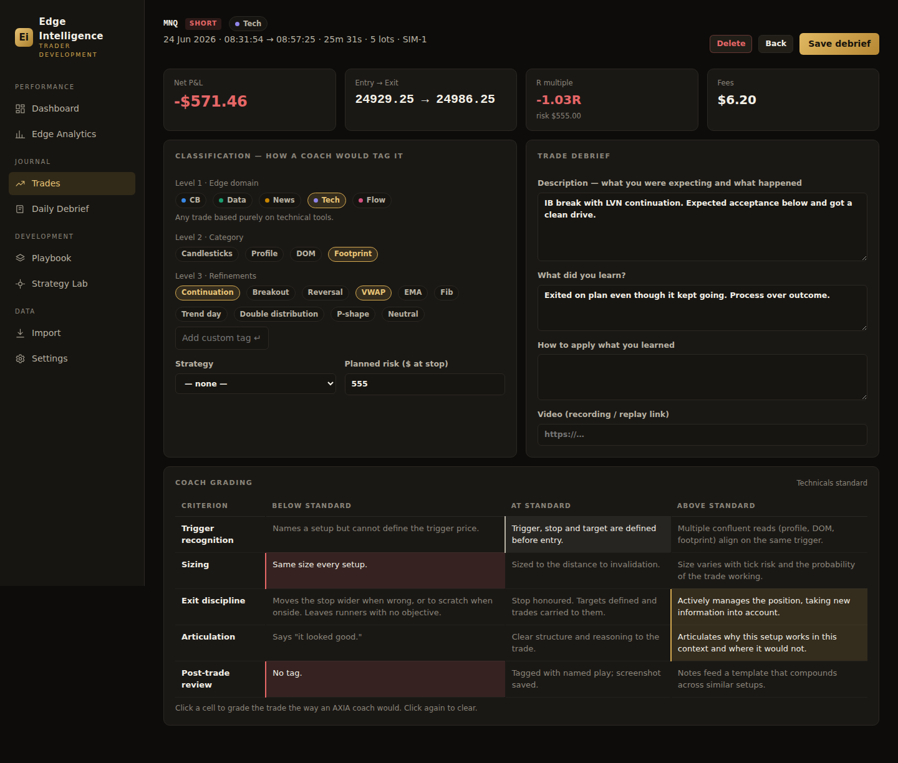
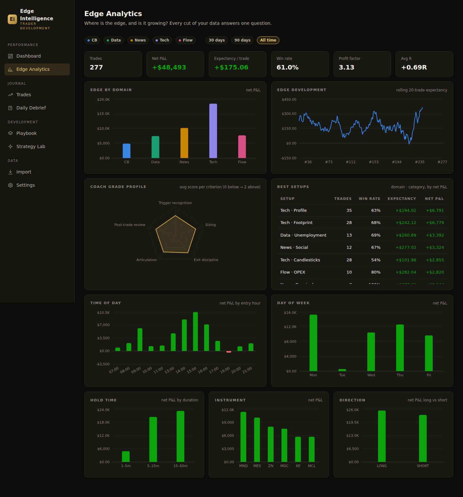
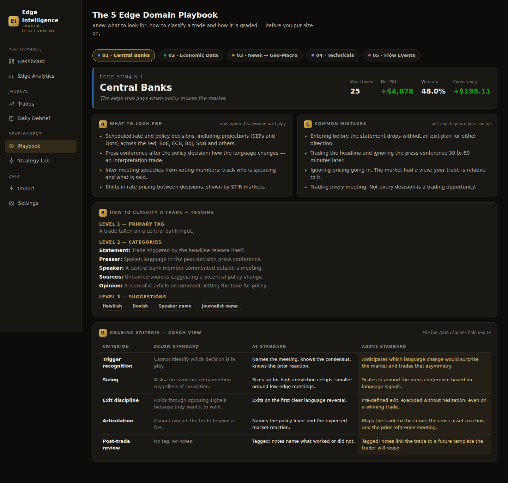

# Edge Intelligence

**The data-centered intelligence platform for futures traders.** Track, analyse and develop trading
strategies around the 5 Edge Domain framework — with the journal, debrief and coach-grading workflow
built in, stunning analytics that show you exactly where your edge is and whether it is growing,
multi-trader cloud accounts, and an AI Coach that turns any AI subscription into a personal
performance analyst with full access to your data.



## What it does

### Data in — from the platforms you already trade on
- **MotiveWave** — export the Trade Log / Trade History to CSV and drop it on the Import page.
  Entry/exit times, prices, size and realized P&L are read directly.
- **Rithmic (R Trader Pro)** — export Order History / Fills to CSV. Raw fills are paired **FIFO per
  contract** into round-trip trades (scale-ins/outs averaged correctly), and P&L is computed from a
  built-in table of CME/Eurex contract point values (ES, MES, NQ, MNQ, CL, MCL, GC, 6E, ZN, FDAX …).
- **Any other platform** — any CSV with symbol, entry/exit time, price, quantity and (optionally)
  P&L columns works. Headers are matched by name; column order and naming variants don't matter.
- **Paste your fills, no file needed** — copy a day's fill/order rows from any platform window
  (Trader One, R Trader, broker statements…) and paste them on the Import page: fills are parsed
  from free-form text, grouped **flat-to-flat into trades per instrument** (position flips split
  correctly), and every fill lands in the trade's execution ladder with its role (entry, add,
  partial exit, exit), blended average and per-fill realized points. The same paste box exists
  inside any single trade to attach its execution ladder after the fact.
- Re-importing the same file is safe — duplicates are detected and skipped.
- **Private by default, synced by choice**: all data lives locally in your browser (IndexedDB) and
  works fully offline. Create a free account (Account page) to sync everything to your own cloud
  profile — protected by row-level security so every trader only ever sees their own data — and
  pick it up on any device. One-click JSON backup / restore in Settings either way.

### The 5 Edge Domain framework, built in
The whole app speaks the AXIA edge-domain language:

1. **Central Banks** — the edge that pays when policy moves the market
2. **Economic Data** — where blowout numbers and policy collide
3. **News (Geo-Macro)** — unscheduled headlines and cross-asset moves
4. **Technicals** — the edge that supports every other domain
5. **Flow Events** — the survival edge when nothing else is in play

Every trade is classified exactly the way a coach would tag it:
- **Level 1** — the edge domain
- **Level 2** — the category inside the domain (Statement/Presser/Speaker…, Candlesticks/Profile/DOM/Footprint…, Auctions/OPEX/Opens/MOC…)
- **Level 3** — refinement tags with per-domain suggestions (Hawkish, Phase 2, Smash & Grab, Pre-close…) plus free-form tags



### Coach grading — the bar coaches hold you to
Each trade can be graded on the five criteria (**Trigger recognition, Sizing, Exit discipline,
Articulation, Post-trade review**) against the *below / at / above standard* rubric of its domain —
the full rubric text is shown in the grading table for the trade's domain. Your average grade
profile is charted as a radar in Edge Analytics, so you can see which skill is lagging.

### The full daily cycle — prepare, execute, debrief
- **Trading Day hub** — preparation, the day's trades and the debrief for one date in a single
  section, with every video, photo and link for that day gathered in one strip.
- **Day preparation** — the AXIA preparation template as a structured form: overnights across the
  markets *you* choose each day (20 common futures one click away — Dollar/DXY, Gold, Crude, ES,
  NQ, DAX, Bunds, ZN… — plus any custom market), news priced-in vs developing, an events table
  with expectations and previous reactions, chart analysis (daily / profile / 60m / 5m) and the
  three hypotheses, each with an in-play trigger and a line-in-the-sand.
- **Trade debrief** — what you expected vs what happened, what you learned, how you'll apply it,
  video link, planned risk (giving automatic R-multiples).
- **Daily debrief** — narrative, comparison with your preparation and hypothesis, lesson, action;
  1–5 self-scores for preparation and execution quality; the day's trades and P&L shown alongside.
- **Photos & videos everywhere** — attach chart screenshots / phone photos (resized and stored
  locally so they work offline) and videos to trades, debriefs and preparations. Sign in and a
  video can be **uploaded and hosted directly in your own private cloud storage folder** with one
  click — no third-party video host required — or just paste any external link instead.
- **Exports** — preparation, trades and debrief each downloadable on their own or combined as a
  full day pack (photos included), in Markdown, JSON or a print-ready page (save as PDF);
  individual trade debriefs too, and any filtered trade list as CSV.
- **Edge Capture — extract from Trader One** (or any web journal with no API/export): a
  bookmarklet records the JSON the page itself downloads (works even on canvas-rendered apps with
  no readable DOM) and continuously scans visible trade tables — including the **Order History /
  executions view**, so every scale-in/scale-out fill (exact size, price, time, market/limit type)
  attaches to its trade. Produces an `edge-capture.json` that imports here — stats, tags,
  descriptions, per-fill execution detail and photos included. Existing trades are enriched, never
  duplicated. If a platform's layout isn't recognised, the app shows the raw headers/field names it
  found so support can be added precisely. Nothing leaves your browser during capture.
- **Execution logger** — every trade has an editable fills ladder: add each decision (entry, every
  scale-in and add, each partial, the exit) with its own order type (market / limit / stop), price,
  size and time, and the role, running position, evolving average price and realized P&L are
  computed live. Saving recomputes the trade's entry/exit/size/P&L from the fills, so a hand-logged
  trade is a first-class one. Fills captured from Trader One land in the same logger and can be
  corrected by hand — so tracking every decision never depends on scraping working.
- **Paste fills** — the fastest path when you don't want to type anything: select your order-history
  rows in Trader One (or any broker), hit **Paste fills** and the whole block parses into the ladder
  at once — side, quantity, price, time and order type, in any column order, with or without a
  header, tab / comma / space separated. Every scale-in and partial, captured in one paste.
- **Study filters** — combine domain, instrument, date and multi-tag filters (setups, phases,
  data events like NFP / CPI / ISM…) across trades, and filter journal days by the tags of the
  trades inside them.

### Accounts & cloud sync — one app, every trader has their own data
The app opens on a **login wall**: each trader signs in to their own profile, so the same deployment
can be shared across a whole desk. Everything — trades, debriefs, preparations, strategies, photos —
syncs automatically to a cloud database a couple of seconds after you make a change, and pulls down
on sign-in anywhere else. Row-level security means a signed-in trader can only ever read or write
their own rows; two traders never see each other's data. Demo data is automatically kept out of your
real cloud profile. (A "continue on this device without an account" link is available for local-only
use, and the app keeps working fully offline either way — the cloud copy is a mirror, not a
requirement.)

### Live data connections — see exactly which feeds are live (Settings)
Whether a free API is actually live for you depends on things only your browser can see — the host's
CORS policy, your network, and (for the market-data key) whether a key is connected. The Settings
page pings **every source from your own browser** and shows a green/red board: CFTC (COT), DBnomics
(official econ history + IMF fallback), GDELT (news), CBOE (VIX & options), the IMF DataMapper, and
your FMP key — each with a live latency, a sample value pulled from the response (e.g. *VIX 16.42*,
*SPY 559.10*, *US GDP thru 2027*), and, when a feed is down, the reason (network/CORS vs. HTTP
error vs. no key). The free market-data key can be pasted right there and the board rechecks
instantly. A **Force-refresh market data** button drops every cached feed (your key and settings are
kept) so the next page visit pulls fresh — the fix when you suspect you're seeing cached numbers.

### AI Coach — turn your AI subscription into a trading analyst
One click builds a complete Markdown dossier of your journal — overview stats, edge tables by
domain/setup/hour/instrument, your coach grade profile, every strategy with its sample stats, the
full chronological trade log (including per-fill scaling detail, tags, descriptions and lessons),
every daily debrief and every preparation with its hypotheses — sized for pasting or attaching to
Claude, ChatGPT or Gemini. Ready-made prompts find hidden patterns, audit your scaling decisions,
grade you like an AXIA coach, and build next week's plan.

### Market Intel — who is positioned where (free, keyless)
The CFTC publishes every trader group's futures positioning weekly through a public API that needs
no key and no account. Market Intel pulls three years of Commitments of Traders history for ~30
futures (ES, NQ, ZN, 6E, CL, GC, BTC …) straight from the trader's browser and turns it into the
read paid COT services sell:

- **Positioning board** — large speculators' net position per market, week-over-week change, where
  it sits in the 3-year range (percentile), a 1-year trend sparkline, and signal chips for
  multi-year extremes, top-decile weekly shifts and net flips.
- **Full market read** — click any market for the 3-year large-spec vs commercial net chart, open
  interest, and a one-line interpretation in trader language (crowded long, drained shorts,
  regime-change flips…).
- **This week's focus** — the idea engine. Positioning extremes × this week's tier-1 catalysts ×
  *your own* per-instrument expectancy, ranked by how many independent reads agree — with every
  reason stated explicitly. A negative personal edge on a market is called out as a caution, not
  hidden. Data is cached locally, so the board keeps working offline between weekly reports.
- **Woven into the workflow** — the Dashboard command center shows the week's focus markets at a
  glance; every market added to the day-preparation *Overnights* section carries its live
  positioning read inline (extremes flagged ⚑); and the AI Coach dossier includes the full
  positioning table + confluence list, so your AI analyst sees the market context alongside your
  trades.

### Macro Map — the context layer for all five edge domains (free, keyless)
One page that answers "what regime am I trading in?" before the open:

- **Narrative monitor** *(News/Geo-Macro)* — global news attention per market theme (Fed, tariffs,
  war, OPEC, banking stress, inflation) from the GDELT project, keyless, updating ~every 15
  minutes. Each theme shows its 2-week attention curve, a **SURGE flag when coverage spikes vs its
  own baseline**, the markets it hits, and one click pulls the live headlines driving the spike.
- **Rates & the policy cycle** *(Central Banks)* — daily Treasury yields from the Fed's own H.15
  via DBnomics: the 2s10s spread history with inversion shading (the cycle clock), today's curve
  overlaid on 1 month and 1 year ago, inversion streak, and a countdown to the next FOMC — plus a
  computed one-line policy read.
- **Cross-asset map** *(Technicals)* — the AXIA preparation question "same movement across
  markets, or one alone?" computed: a 20-day correlation heatmap across equities, bonds, dollar,
  gold, crude and euro, **correlation-break detection** (pairs that left their 60-day norm — gold
  outlined), and each market's trend + volatility-percentile state.
- **Breadth & sector rotation** *(Technicals/Sentiment)* — with the free market-data key: how many
  of the 11 S&P sectors trade above their 50-day average, equal-weight vs cap-weight (RSP−SPY)
  divergence, and a 20-day sector-rotation ranking with momentum bars — sortable by momentum or
  distance from the 50DMA — so narrow rallies and defensive rotations are visible before they hit
  the index.
- **Global growth & the IMF outlook** *(Central Banks / Macro)* — the IMF's World Economic Outlook
  growth and inflation forecasts for the US, China, Germany, Japan, UK and the world (history plus
  the IMF's forward projections), auto-connected with no key: the primary source is the IMF
  DataMapper API, and if that is unreachable from the browser the DBnomics mirror of the same
  dataset answers instead. A computed read turns the numbers into the slow currents that matter —
  growth differentials that keep the dollar bid, world growth vs the ~3% stall line for commodity
  demand, and whether inflation is back at target (so growth data replaces inflation data as the
  release that owns the tape). Underneath, the **IMF Primary Commodity Price System** monthly
  indices (energy, crude, gold, copper) with 3- and 12-month changes — the demand/supply context
  under CL, GC and HG.
- **The flow calendar** *(Flow Events)* — OPEX, quad witching, futures roll, VIX expiry,
  month/quarter-end rebalancing, auction weeks and new-month inflows, computed from exchange rules
  with zero API — merged into the same calendar as the economic events, so flow days appear in the
  week-ahead, the session radar, day preparation and your own event-day stats, each with its
  mechanics and playbook attached.
- **The learning layer** — every panel carries a collapsible **Principle** written in the
  framework's language, so the platform teaches the meaning and application of each domain every
  time it's used.

### Options & Vol — the dealer-flow layer (free, keyless)
The mechanics that move the index intraday, from CBOE's own delayed-quote feed — no key, no
account. CBOE's CDN doesn't allow direct browser calls (CORS), so — like the BLS data — a small
serverless proxy that ships with the app (`/api/cboe`) fetches it server-side and slims the chain
to the strikes near spot before handing it to the browser. Nothing to configure:

- **The VIX complex, live** — VIX, VIX9D and VIX3M refreshing every minute, with the 9D/30D and
  30D/3M term-structure ratios computed into a **vol regime** (calm carry / nervous / event
  premium / stress-backwardation) and a plain-language read of what that regime means for day
  trading index futures.
- **Dealer gamma & the walls, per instrument** — the full option chain (per-strike open interest +
  gamma) for **SPX → ES, NDX → NQ and RUT → RTY**, turned into a net gamma-exposure profile:
  **put wall**, **call wall**, the **zero-gamma flip point**, and the current **gamma regime**
  (positive = dealers dampen moves, pinning; negative = dealers amplify moves, air pockets and
  trend days). A per-strike GEX chart brackets the session around spot, filterable by **nearest
  expiry / monthly OPEX / all expiries**.
- **Expected-move rails** — the options market's own priced range from ATM implied vol: the 1σ
  daily move (±points and %), today's 68% range, and the move out to the nearest expiry, drawn as a
  spot-centered band. These are the intraday rails — ~68% of sessions finish inside the daily band,
  the edges are where the fade-vs-breakout decision lives, and the gamma regime tells you which way
  to lean (band holds in positive gamma, breaks in negative).
- **Cumulative gamma-flip profile** — the SpotGamma-style curve: cumulative dealer gamma across
  strikes, crossing zero at the flip, so you can see where hedging turns from stabilizing to
  destabilizing.
- **Key dealer levels ladder** — the actionable levels extracted per instrument (call wall, gamma
  magnet, zero-gamma flip, acceleration strike, put wall), each with its distance from spot and
  the expected behavior at it, plus how to map index levels onto the futures chart.
- **Expiration & flow calendar** — every mechanical date in the next six weeks with the **exact
  settlement hours and mechanics** (SPX AM-settled monthlies stop trading Thursday 16:00 and
  settle on Friday's 09:30 SOQ; VIX expiry Wednesdays settle on the 09:30 SPX-option SOQ; PM
  expiries die at 16:00; auctions at 13:00; rebalancing 15:00–16:00), a day-by-day **OPEX-week
  playbook** (charm/vanna drift → VIX-expiry reset → the pin → the Monday-after unclenching), and
  the OPEX open-interest concentration tile.
- **The session's flow map** — the recurring mechanical windows of every US day (cash open &
  opening drive, the 10:00 data window, lunch/European close, afternoon re-engagement, the 15:50
  MOC imbalance window), each with *why it exists* and *the play*.
- Every panel carries its collapsible **Principle** — vol term structure, dealer gamma/walls/OPEX
  mechanics, and trading the opens & MOC — so the section teaches the flow domain while you use it.

### Release intelligence — the data behind every catalyst (free)
The Catalysts section doesn't just list NFP and CPI — it shows what each release has actually been
**printing**, and it gets that data **current with zero setup**:

- **Official BLS data, keyless, no setup** — CPI, NFP, PPI and JOLTS come straight from the U.S.
  Bureau of Labor Statistics' own API through a tiny serverless proxy that ships with the app
  (`/api/bls`). The BLS API doesn't allow direct browser calls (no CORS), so the proxy fetches it
  server-side on your own deployment and hands the app **current, official prints** — you don't
  enter a key or configure anything. Keyless it uses BLS v1 (GET per series, the current ~3 years),
  which the app merges onto the deep DBnomics history so the chart keeps its full range *and* a
  current last print; set an optional free `BLS_API_KEY` env var and it upgrades to v2 (10 years in
  one call, higher limits). Responses are edge-cached 24h.
- **The full subcomponent breakdown** — for CPI, an expandable "full basket" table shows the real
  index level, month-over-month, year-over-year and 3-month-annualized run-rate for the headline,
  core, and every major subcomponent (shelter, core services / "supercore", core goods, food,
  energy) side by side — with basket weights and a computed **cross-read** that tells you what the
  split *means* (is disinflation coming from goods or services? is shelter still the sticky
  driver?). It's the release breakdown economic-calendar sites don't give you.
- **Resilient fallbacks** — if the proxy is unavailable (e.g. running the dev server locally), the
  app falls back to the DBnomics mirror of the same official data, and then — if you've connected a
  free market-data key — to the as-released actuals from its historical calendar. The provenance of
  every segment is stated under the chart (official source, current to X · or · official history to
  X · extended with N live prints to Y), so you always know exactly where the numbers came from.

Retail Sales and Core PCE, which have no free keyless mirror at all, build their history entirely
from the live layer:

- **Print history charts** — 4 years of prints per indicator (payrolls change, unemployment, AHE,
  headline & core CPI m/m, core CPI y/y, PPI, JOLTS openings, both ISMs), with the ±1σ band and
  2-year average drawn in and the latest print highlighted — outliers are visible at a glance.
- **Pre-release read, computed** — z-score of the last print vs the 2-year trend, 3-month vs
  12-month pace (momentum building or fading), 5-year percentile, consecutive-print streaks and a
  print-volatility regime check — condensed into one plain-language insight line, plus **your own
  record** on that event's days from your trade history.
- **Live consensus → actual, with NO key required** — the week-ahead list carries each event's
  consensus and previous, refreshing every minute on release days, with the actual landing next to
  it with a deviation arrow the moment it prints — the same live experience as the popular free
  calendar sites, because the keyless fallback *is* their weekly feed (relayed by the `/api/ffcal`
  proxy that ships with the app). Official BLS prints (CPI/NFP/PPI/JOLTS) land via `/api/bls` at
  release time. Connecting FMP upgrades the layer (full history ranges, more countries): either
  paste a key in Settings, **or set it once server-side** as a `FMP_API_KEY` environment variable
  on the deployment (Vercel → Settings → Environment Variables) and every device works with no
  browser setup — the app relays through its own `/api/fmp`.
- **Filter the week by domain** — one-tap chips cut the week-ahead to economic data, flow events
  (OPEX, auctions, rebalancing), central banks, or tier-1 only.
- **Recent prints table** — the last six prints with per-print deltas and the source of each row
  (official vs live calendar), so the record behind the chart is inspectable.
- **Market implications study** — for every catalyst, the instrument-by-instrument first-move map
  (ES / NQ / ZN / 6E / GC / CL for a hot vs cold print), *which number inside the release actually
  moves markets* (core m/m, the control group, prices-paid…), the regime in which the standard
  mapping inverts, and the principle that survives both.
- Everything caches locally: history keeps working offline, and each indicator degrades
  independently with an inline note if a source is unreachable.
- **Honest dates** — releases whose exact date shifts month to month (CPI, PPI, Retail, JOLTS,
  PCE, auction weeks) are computed as *estimates* and clearly marked **~ est.** offline. With the
  free market-data key connected, the calendar **reconciles them automatically**: confirmed dates
  lose the marker, mis-anchored estimates move to their real day, and releases that aren't
  scheduled that period disappear instead of showing as phantoms. Fixed-rule events (NFP incl.
  the July-4th shift, claims, FOMC, ISM, OPEX/witching/rebalancing) are exact.

### Session Clock — the day's structure, live in Lisbon time
Every time in the app is shown in **Europe/Lisbon** (WET/WEST), regardless of the device's own
timezone, so the schedule reads the same on any machine. The Session Clock turns that into a live,
to-the-second view of the trading day:

- **A live clock** in Lisbon with New York (ET), London and UTC alongside.
- **Every session** — Asia (Tokyo), Europe (London/Frankfurt), US cash equities (NYSE RTH), Metals
  (COMEX pit), Oil (NYMEX pit) and US Treasuries (CBOT) — each defined in its *own* market timezone
  (so DST on both sides is always correct) and shown as **open / opens-in / closes-in** with a live
  progress bar, elapsed time and session length.
- **A 24-hour timeline** placing every session on the Lisbon day with a live "now" marker, so the
  **overlaps** are obvious at a glance.
- **Prime time** — the Europe × US-cash overlap, the deepest-liquidity window of the day — computed
  live with its own countdown.
- A **Principle** on timing the day, plus a why/how note on every session (why the window matters
  and how to trade it) so the map teaches the session playbook while you use it.

### Charts — TradingView inside the platform
The Charts section embeds TradingView's free Advanced Chart widget: full price history, live
updating quotes, and the complete drawing/indicator toolset, rendered in Lisbon time like the rest
of the app. One-click chips cover the platform's instruments — ES, NQ, RTY, YM, ZN, ZB, 6E, GC, CL
plus the real-time cash proxies (SPX, NDX, VIX, DXY) — with timeframe chips from 5m to weekly, and
your last symbol/timeframe choice remembered. A teaching block explains how to combine the chart
with the other sections (draw the dealer levels from Options & Vol, time-stamp the session opens
and release times, use VWAP as fair value), and an honest data note: futures quotes on the free
embed are ~10 min exchange-delayed, while the cash indices update in real time.

### Live day-ahead briefing
The preparation page can connect a free market-data key (financialmodelingprep.com) and fills
itself in every morning: today's tier-1 economic events with consensus and previous prints —
actuals appear the moment they're released — plus an overnight risk-sense read across equities,
vol, rates, dollar, metals and energy. Auto-refreshes while you prepare.

### Analytics that answer real questions


- Equity curve, daily P&L, 6-month P&L calendar heatmap
- Net P&L, win rate, profit factor, expectancy ($ and R), payoff ratio, max drawdown, streaks,
  annualized daily Sharpe, average hold time
- **Edge by domain** and **best setups** (domain × category) ranked by expectancy
- **Edge development** — rolling 20-trade expectancy shows edge growing or decaying
- Time-of-day, day-of-week, hold-time, instrument and direction breakdowns
- **Review discipline** — % of trades tagged and graded, because the review *is* the development
- Coach grade radar across the five criteria

### Strategy Lab
Turn observations into templates and templates into tested strategies: each strategy has a
hypothesis, rules and a lifecycle (**incubating → testing → active → retired**). Link trades to a
strategy from the debrief page and the sample stats (trades, net P&L, win rate, expectancy, avg R)
build automatically.

### The Playbook
The full 5 Edge Domain playbook as an interactive reference — what to look for, how to classify,
common mistakes and the grading rubric for every domain — with **your own live stats** (trades, P&L,
win rate, expectancy) displayed next to each domain. The Technical domain opens into a **deep
dive on its four sub-disciplines** — candlesticks & chart patterns, Market Profile & value, DOM
(depth of market), and footprint & order flow — each with what it reads, the specific patterns
and behaviors (absorption, delta divergence, spoofing/pulling, poor highs/lows, open types…), and
the mistakes that cost traders money in that discipline.



## Getting started

```bash
npm install
npm run dev       # development server
npm run build     # production build (output in dist/)
npm run preview   # serve the production build
```

Open the app, click **Load demo data** to explore the full platform with a realistic 8-month
dataset, then clear it in Settings and import your own trades.

## Tech

- React 18 + TypeScript + Vite
- Dexie (IndexedDB) — local-first, offline-capable
- Supabase (Postgres + Auth + Storage) — optional cloud accounts, row-level-security-protected
  sync, and private media storage
- Recharts — visualizations follow a validated dark-surface palette (colorblind-safe categorical
  colors, diverging profit/loss encoding)
- No telemetry; data never leaves your device unless you create an account
